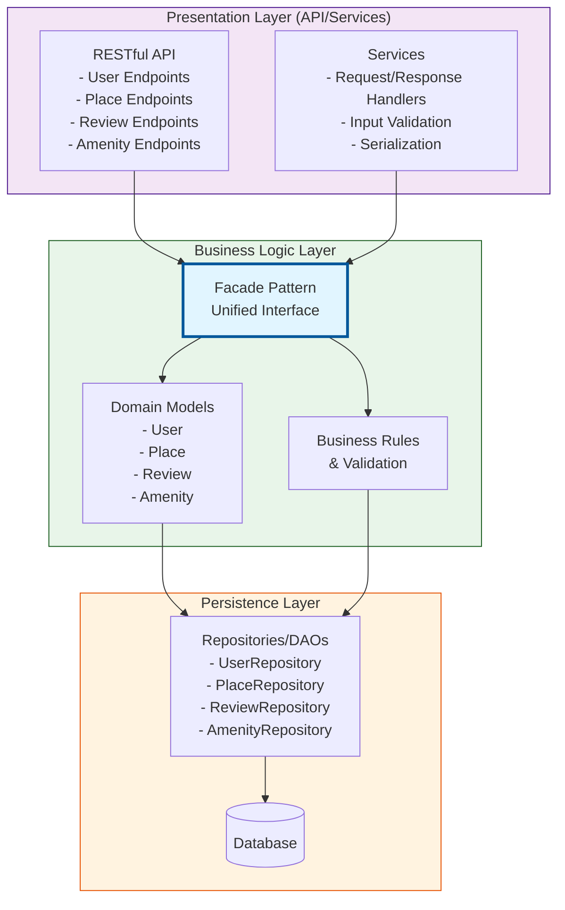
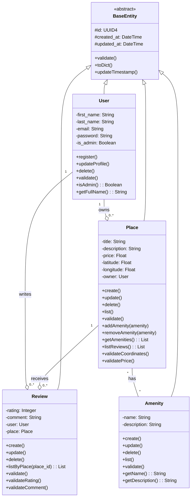
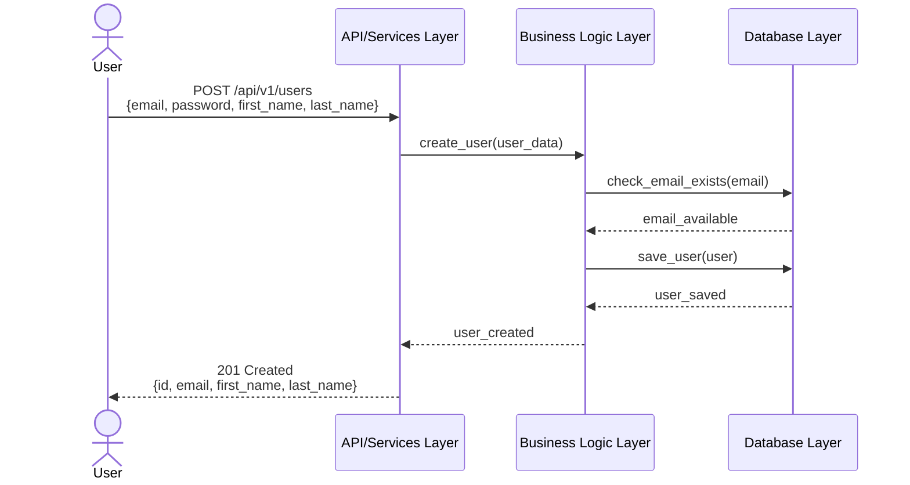
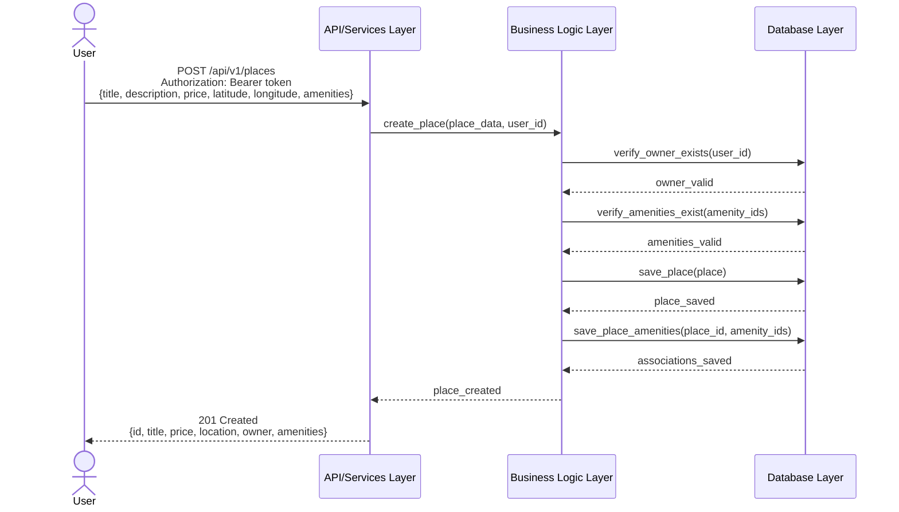
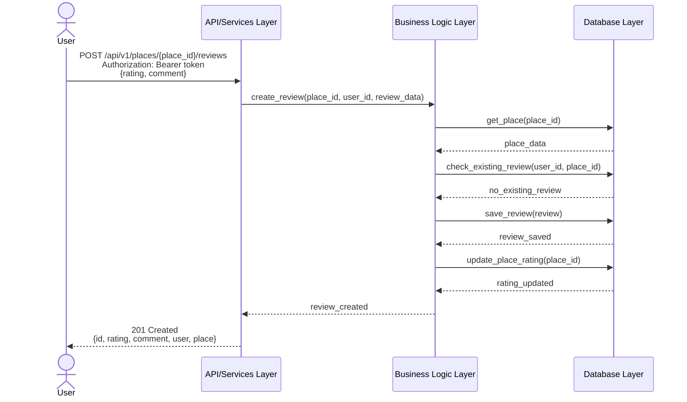
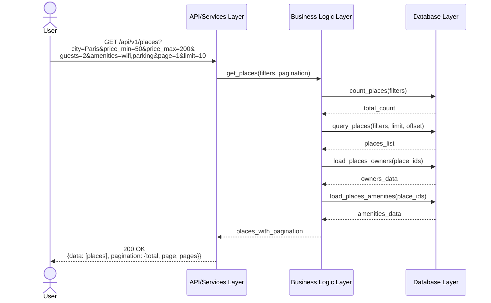

# HBnB Application - Technical Documentation

**Comprehensive Architecture and Design Blueprint**

---

## Table of Contents
1. [Introduction](#1-introduction)
2. [High-Level Architecture](#2-high-level-architecture)
3. [Business Logic Layer - Detailed Class Diagram](#3-business-logic-layer---detailed-class-diagram)
4. [API Interaction Flow - Sequence Diagrams](#4-api-interaction-flow---sequence-diagrams)
5. [Conclusion](#5-conclusion)

---

## 1. Introduction

### 1.1 Document Purpose
This technical documentation serves as the comprehensive blueprint for the HBnB (Holberton BnB) application development project. It provides detailed architectural diagrams, design patterns, and implementation guidelines that will guide the development team through all phases of the project lifecycle.

The document encompasses three critical architectural views:
- **High-Level Architecture**: Package structure showing the three-layer architecture
- **Business Logic Layer**: Detailed class diagram with entity relationships
- **API Interaction Flows**: Sequence diagrams for key API operations

### 1.2 Project Overview
HBnB is a modern, web-based vacation rental platform inspired by Airbnb. The application allows property owners to list their places, enables users to search and filter available properties, and provides a comprehensive review system for maintaining quality and trust within the community.

**Key Features:**
- User Management: Registration, authentication, and profile management
- Place Listings: Property creation with detailed information including location, pricing, and amenities
- Review System: User-generated reviews with ratings to promote transparency and quality
- Search and Filter: Advanced search capabilities based on location, price, capacity, and amenities
- Amenity Management: Flexible system for defining and associating property features

### 1.3 Document Scope
This document covers the complete architectural design of the HBnB application, including:
- Layered architecture and component organization
- Design patterns (Facade pattern) and architectural principles
- Entity models and their relationships
- API interaction flows and communication patterns
- Data persistence strategies

### 1.4 Target Audience
This document is intended for:
- Software developers implementing the application
- System architects reviewing the design
- Project managers planning development phases
- Quality assurance teams developing test strategies
- Technical stakeholders evaluating the architecture

---

## 2. High-Level Architecture

### 2.1 Overview
The HBnB application follows a **three-layer architecture** pattern that promotes separation of concerns, maintainability, and scalability. This architectural approach divides the system into three distinct layers, each with specific responsibilities and clear boundaries.

### 2.2 Package Diagram



### 2.3 Architecture Layers

#### 2.3.1 Presentation Layer (API/Services)

**Responsibility:** Handle user interaction and incoming HTTP requests

**Key Components:**
- **RESTful API Endpoints**: Routes and controllers for handling HTTP requests
  - User endpoints: Registration, authentication, profile management
  - Place endpoints: CRUD operations for property listings
  - Review endpoints: Submission and retrieval of reviews
  - Amenity endpoints: Management of property features
  
- **Services**: Request/response handlers and orchestration
  - Input validation at the API boundary
  - Serialization/deserialization (JSON ↔ objects)
  - Authentication and authorization
  - Error handling and HTTP status codes

**Communication:**
- Communicates with Business Logic layer **only through the Facade**
- Never directly accesses domain models or persistence components

---

#### 2.3.2 Business Logic Layer (Domain Models & Rules)

**Responsibility:** Implement core business rules and domain logic

**Key Components:**
- **Facade Pattern**: Unified entry point for application use-cases
  - Simplifies communication between layers
  - Provides single interface for business operations
  - Reduces coupling between layers
  
- **Domain Models**: Core entities representing business concepts
  - `User`: System users (owners and guests)
  - `Place`: Property listings
  - `Review`: User reviews and ratings
  - `Amenity`: Property features and services
  
- **Business Rules & Validation**: Domain constraints and invariants
  - User email uniqueness
  - Review restrictions (no self-reviews, one review per place)
  - Price and rating validations
  - Coordinate validations

**Communication:**
- Receives requests from Presentation layer via the **Facade**
- Interacts with Persistence layer through repositories/DAOs
- Never directly accessed by Presentation layer

---

#### 2.3.3 Persistence Layer (Data Access)

**Responsibility:** Manage data storage and retrieval

**Key Components:**
- **Repositories/DAOs**: Data access components for each entity
  - `UserRepository`: User data operations
  - `PlaceRepository`: Place data operations
  - `ReviewRepository`: Review data operations
  - `AmenityRepository`: Amenity data operations
  
- **Database Operations**: CRUD and query execution
  - SQL query construction and execution
  - Transaction management
  - Data integrity enforcement
  
- **Database**: Storage engine (relational database)

**Communication:**
- Provides data access services to Business Logic layer
- **Never** communicates directly with Presentation layer
- Accessed only through repositories by business logic

---

### 2.4 The Facade Pattern

#### 2.4.1 Purpose
The Facade provides a **unified interface** between the Presentation Layer and the Business Logic Layer, acting as a single entry point for all business use-cases.

#### 2.4.2 Benefits
✅ **Simplified Interface**: API layer has clear, simple methods to call  
✅ **Reduced Coupling**: Presentation doesn't depend on internal business logic structure  
✅ **Centralized Access**: Single point for managing business operations  
✅ **Improved Maintainability**: Changes in business logic don't affect API  
✅ **Better Testability**: Each layer can be tested independently  

#### 2.4.3 Communication Flow

```
Client Request
    ↓
API/Services Layer (Presentation)
    ↓
Facade (Business Logic Entry Point)
    ↓
Domain Models & Business Rules
    ↓
Repositories/DAOs (Persistence)
    ↓
Database
    ↓
Response flows back through same path
```

### 2.5 Architectural Principles

#### 2.5.1 Separation of Concerns
Each layer has distinct, non-overlapping responsibilities:
- **Presentation**: HTTP protocol, request/response handling
- **Business Logic**: Domain rules, entity management, validation
- **Persistence**: Data storage, retrieval, integrity

#### 2.5.2 Dependency Direction
Dependencies flow in one direction (top to bottom):
- Presentation → Business Logic (via Facade)
- Business Logic → Persistence
- Lower layers never depend on upper layers

#### 2.5.3 Interface Abstraction
Layers interact through well-defined interfaces:
- API uses Facade interface
- Business Logic uses Repository interfaces
- Enables easy replacement and unit testing with mocks

---

## 3. Business Logic Layer - Detailed Class Diagram

### 3.1 Overview
The Business Logic Layer contains the core domain models that represent the fundamental entities in the HBnB system. These models encapsulate both data and behavior, implementing business rules and maintaining relationships between entities.

### 3.2 BaseEntity Design

All domain entities inherit from a common `BaseEntity` abstract class that provides fundamental functionality:

#### Purpose
Foundation for all domain entities, implementing core requirements:
- Unique identification via UUID4
- Audit trail tracking with timestamps
- Common validation and serialization methods

#### Key Features
- **Abstract Class**: Cannot be instantiated directly
- **UUID Generation**: Automatic generation of unique identifiers
- **Timestamp Management**: Tracks creation and modification times
- **Common Interface**: Standard methods for all entities

#### Compliance with Requirements
✅ **Unique IDs**: Each object has a UUID4 identifier  
✅ **Audit Trail**: `created_at` and `updated_at` timestamps  
✅ **Business Logic**: Common validation and serialization methods  

### 3.3 Class Diagram



### 3.4 Entity Descriptions

#### 3.4.1 User

**Purpose:** Represents a registered user in the system (property owner or guest)

**Inheritance:** Inherits from `BaseEntity`  
→ Provides `id`, `created_at`, `updated_at` attributes

**Additional Attributes:**
- `first_name`, `last_name`: Personal information
- `email`: Unique email for authentication
- `password`: Hashed password for security
- `is_admin`: Administrative privileges flag

**Key Methods:**
- `register()`: Creates new user account
- `updateProfile()`: Updates user information
- `delete()`: Removes user account
- `validate()`: Validates user data
- `isAdmin()`: Checks admin privileges
- `getFullName()`: Returns full name

**Business Rules:**
- Email must be unique across all users
- Password must be hashed before storage
- Email format validation required

---

#### 3.4.2 Place

**Purpose:** Represents a property listing available for rental

**Inheritance:** Inherits from `BaseEntity`

**Additional Attributes:**
- `title`: Property name/title
- `description`: Detailed description
- `price`: Nightly rental price
- `latitude`, `longitude`: Geographic coordinates
- `owner`: Reference to owning User

**Key Methods:**
- `create()`: Creates new property listing
- `update()`: Updates property details
- `delete()`: Deletes property
- `list()`: Retrieves all places
- `validate()`: Validates place data
- `addAmenity()`: Adds amenity to place
- `removeAmenity()`: Removes amenity
- `getAmenities()`: Retrieves all amenities
- `listReviews()`: Retrieves reviews
- `validateCoordinates()`: Validates lat/long
- `validatePrice()`: Validates price value

**Relationships:**
- One-to-Many with Review
- Many-to-Many with Amenity
- Many-to-One with User (owner)

---

#### 3.4.3 Review

**Purpose:** Represents user review and rating of a place

**Inheritance:** Inherits from `BaseEntity`

**Additional Attributes:**
- `rating`: Numeric rating (1-5)
- `comment`: Review text
- `user`: Reference to reviewing User
- `place`: Reference to reviewed Place

**Key Methods:**
- `create()`: Creates new review
- `update()`: Updates review details
- `delete()`: Deletes review
- `listByPlace()`: Retrieves reviews for place
- `validate()`: Validates review data
- `validateRating()`: Ensures rating 1-5
- `validateComment()`: Validates review text

**Business Rules:**
- One review per user per place
- Users cannot review own properties
- Rating must be between 1 and 5

---

#### 3.4.4 Amenity

**Purpose:** Represents feature or service at a property

**Inheritance:** Inherits from `BaseEntity`

**Additional Attributes:**
- `name`: Amenity name (e.g., "WiFi", "Pool")
- `description`: Amenity description

**Key Methods:**
- `create()`: Creates new amenity
- `update()`: Updates amenity details
- `delete()`: Deletes amenity
- `list()`: Retrieves all amenities
- `validate()`: Validates amenity data
- `getName()`: Returns name
- `getDescription()`: Returns description

**Relationships:**
- Many-to-Many with Place

---

### 3.5 Relationship Details

#### 3.5.1 User – Place Relationship
**Type:** One-to-Many (Composition)  
**UML:** `User "1" --o "0..*" Place : owns`  
**Implementation:** Direct object reference (`owner: User` in Place)

A User can own multiple Places, but each Place has exactly one owner.

---

#### 3.5.2 Place – Review Relationship
**Type:** One-to-Many (Composition)  
**UML:** `Place "1" --o "0..*" Review : receives`  
**Implementation:** Direct object reference (`place: Place` in Review)

A Place can have multiple Reviews, but each Review belongs to one Place.

---

#### 3.5.3 User – Review Relationship
**Type:** One-to-Many (Composition)  
**UML:** `User "1" --o "0..*" Review : writes`  
**Implementation:** Direct object reference (`user: User` in Review)

A User can write multiple Reviews, but each Review is written by one User.

---

#### 3.5.4 Place – Amenity Relationship
**Type:** Many-to-Many (Association)  
**UML:** `Place "*" -- "*" Amenity : has`  
**Implementation:** Managed through `addAmenity()` and `removeAmenity()` in Place class

A Place can have multiple Amenities, and an Amenity can belong to multiple Places.

---

## 4. API Interaction Flow - Sequence Diagrams

### 4.1 Overview
This section presents sequence diagrams illustrating how the different layers interact to process specific API requests. Each diagram shows the flow of control and data from request receipt to response return.

### 4.2 User Registration

#### Description
Handles creation of new user accounts with validation, duplicate checking, password hashing, and database persistence.

#### Key Steps
1. Client sends registration request with user details
2. API/Services layer validates request format
3. Business Logic checks if email already exists
4. Password is hashed for security
5. User entity is created and validated
6. User is persisted to database
7. Success response returned (excluding password)

#### Sequence Diagram



---

### 4.3 Place Creation

#### Description
Enables authenticated users to create property listings with validation of ownership, amenities, and proper database relationships.

#### Key Steps
1. Client sends authenticated request with place details
2. API/Services layer validates authentication token
3. Business Logic validates place data
4. System verifies owner exists and amenities are valid
5. Place entity is created with relationships
6. Place is persisted with owner and amenity associations
7. Success response with complete details returned

#### Sequence Diagram



---

### 4.4 Review Submission

#### Description
Allows authenticated users to submit reviews with enforcement of business rules (no self-reviews, one review per place).

#### Key Steps
1. Client sends authenticated request with review details
2. API/Services layer validates authentication token
3. Business Logic validates review data (rating 1-5)
4. System checks place exists and user hasn't already reviewed
5. System prevents users from reviewing own places
6. Review entity is created with user and place associations
7. Review is persisted to database
8. Place's average rating is updated
9. Success response with review details returned

#### Sequence Diagram



---

### 4.5 Fetching a List of Places

#### Description
Retrieves places based on filtering criteria (location, price, capacity, amenities) with pagination support.

#### Key Steps
1. Client sends GET request with query parameters
2. API/Services layer validates and parses parameters
3. Business Logic builds filter criteria
4. Database counts total matching places
5. Database query constructed with WHERE clauses
6. Results fetched with pagination (limit/offset)
7. Associated data (owner, amenities) loaded
8. Paginated response with metadata returned

#### Sequence Diagram



---

### 4.6 Common Patterns

#### Request Validation Flow
All operations follow consistent validation:
- **Format Validation** (API/Services): Check structure and data types
- **Authentication** (API/Services): Verify identity and permissions
- **Business Validation** (Business Logic): Enforce business rules
- **Data Integrity** (Database): Ensure referential constraints

#### Error Handling
Errors propagate up from each layer:
- **API/Services**: 400 Bad Request, 401 Unauthorized, 403 Forbidden
- **Business Logic**: 409 Conflict, 422 Unprocessable Entity
- **Database**: 500 Internal Server Error, constraint violations

#### Data Transformation
Data transformed at each boundary:
- Client → API: JSON to request objects
- API → Business Logic: Request objects to domain entities
- Business Logic → Database: Domain entities to database records
- Response path: Reverse transformation with sensitive data filtering

---

## 5. Conclusion

### 5.1 Summary
This technical documentation has presented a comprehensive design for the HBnB application, covering:
- **High-level package structure** with three-layer architecture
- **Detailed business logic layer** with entity relationships
- **Dynamic API interaction flows** showing layer communication

The architecture provides a solid foundation for building a maintainable, scalable, and well-organized application.

### 5.2 Key Architectural Decisions

✅ **Three-Layer Architecture**: Separates concerns between presentation, business logic, and persistence  
✅ **Facade Pattern**: Simplifies layer interaction and provides centralized control  
✅ **Repository Pattern**: Abstracts data access and enables easy testing  
✅ **RESTful API Design**: Follows REST principles for predictable communication  
✅ **Business Rule Enforcement**: Implements domain constraints in business logic layer  

### 5.3 Implementation Guidance

Development teams should:
1. Start with Business Logic Layer (core models and validation)
2. Implement Persistence Layer with repositories
3. Build the Facade to coordinate business operations
4. Develop Presentation Layer endpoints using the Facade
5. Write comprehensive unit tests for each layer
6. Create integration tests for cross-layer communication

### 5.4 Benefits of This Architecture

**Maintainability**
- Clear separation makes code easier to understand and modify
- Changes in one layer have minimal impact on others

**Testability**
- Each layer can be tested independently
- Mock implementations easy to create for unit testing

**Scalability**
- Layers can be scaled independently
- Can evolve to microservices architecture if needed

**Security**
- Centralized validation and authentication
- Clear boundaries prevent unauthorized access

### 5.5 Next Steps

1. **Implementation Phase**: Begin coding based on this architecture
2. **Code Review**: Ensure implementation follows design patterns
3. **Testing**: Develop comprehensive test suite for all layers
4. **Documentation**: Keep documentation updated as system evolves
5. **Monitoring**: Implement logging and monitoring at each layer

---

**Created by:** Maryam Alessa & Munirah Enad Alotaibi  
**Project:** HBnB Evolution - Part 1  
**Date:** February 2026  
**Version:** 1.0

---

## Appendix

### API Endpoint Summary

| Endpoint | Method | Purpose | Auth Required |
|----------|--------|---------|---------------|
| `/api/v1/users` | POST | User registration | No |
| `/api/v1/places` | POST | Create place listing | Yes |
| `/api/v1/places` | GET | List/search places | No |
| `/api/v1/places/{id}/reviews` | POST | Submit review | Yes |

### Technology Stack Recommendations

- **Backend Framework**: Flask/FastAPI (Python) or Express.js (Node.js)
- **Database**: PostgreSQL or MySQL
- **ORM**: SQLAlchemy (Python) or Sequelize (Node.js)
- **Authentication**: JWT tokens
- **API Documentation**: Swagger/OpenAPI
- **Testing**: pytest (Python) or Jest (Node.js)

### Additional Resources

- [RESTful API Design Best Practices](https://restfulapi.net/)
- [Facade Pattern Documentation](https://refactoring.guru/design-patterns/facade)
- [Three-Tier Architecture Guide](https://www.ibm.com/topics/three-tier-architecture)

---

## 👥 Authors
**Amaal Asiri**,
**Maryam Alessa**,
**Munirah Alotaibi** 
– A group project as part of Holberton School curriculum.

---

## 📄 License
This project is open source and intended for educational purposes as part of the Holberton School curriculum.
