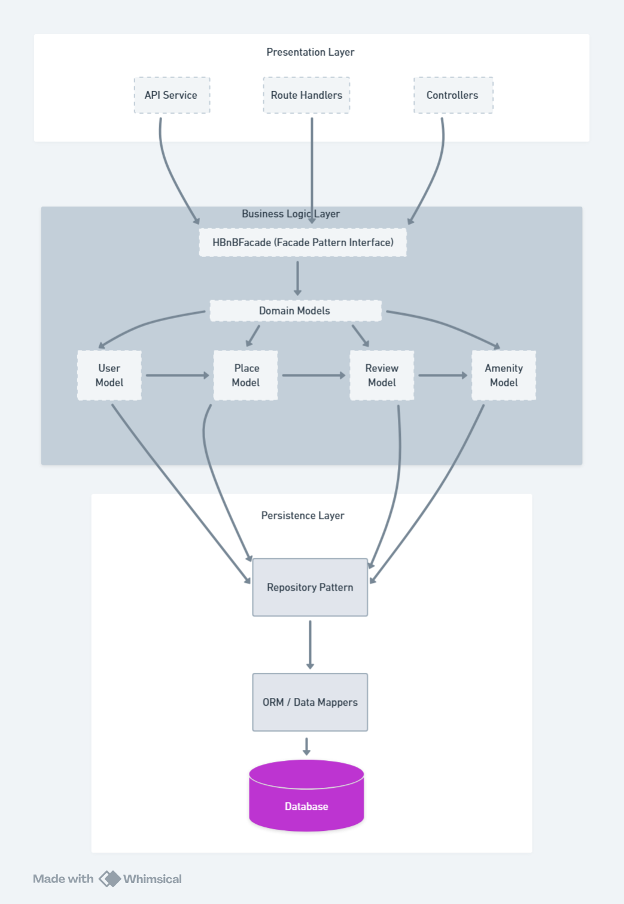

## Task 0: High-Level Package Diagram

## Overview
This package diagram shows the three-layer architecture of the HBnB Evolution application and how layers communicate through the Facade design pattern.

## Architecture Layers

### 1) Presentation Layer (Services & API)
- **Responsibility:** Handles user interactions and HTTP requests/responses.
- **Components:** API endpoints, route handlers, controllers/serializers.
- **Communication:** Calls the Business Logic only through **HBnBFacade** (no direct access to models or database).

### 2) Business Logic Layer (Domain Models)
- **Responsibility:** Implements core business rules and validations.
- **Components:** Domain entities (User, Place, Review, Amenity) + service logic.
- **Communication:** Uses persistence interfaces (repositories/DAOs) to store and retrieve data.

### 3) Persistence Layer (Data Access)
- **Responsibility:** Data storage and retrieval.
- **Components:** Repository/DAO layer, ORM/data mappers, database.
- **Communication:** Provides data operations to the Business Logic layer only.

## Facade Pattern (HBnBFacade)
The Facade provides a unified entry point to the business logic:
- Reduces coupling between Presentation and internal domain/persistence details
- Centralizes access to use-cases (create/update/delete/list)
- Improves maintainability and testability

## Request Flow (High-Level)
Client → API/Controllers → **HBnBFacade** → Domain Models/Services → Repositories → Database → Response

# Package Diagram

## High-Level Package Diagram

## Detailed Packge Diagram

## Explanatory Notes

### Key Benefits
- **Separation of Concerns:** Each layer has a clear responsibility, making the system easier to maintain and test.
- **Facade Pattern:** Provides a single entry point to business logic, reducing coupling between layers.
- **Scalability:** Layers can evolve independently and new features can be added with minimal impact.

### Communication Flow
Client → API Services/Controllers (Presentation)  
→ **HBnBFacade** (Business Logic)  
→ Domain Models (User/Place/Review/Amenity)  
→ Repository/DAO (Persistence)  
→ Database  
→ Response returns back through the same path

**Created by**: Munirah Enad Alotaibi 

**Project**: HBnB Evolution - Part 1

**Date**: January 2026
