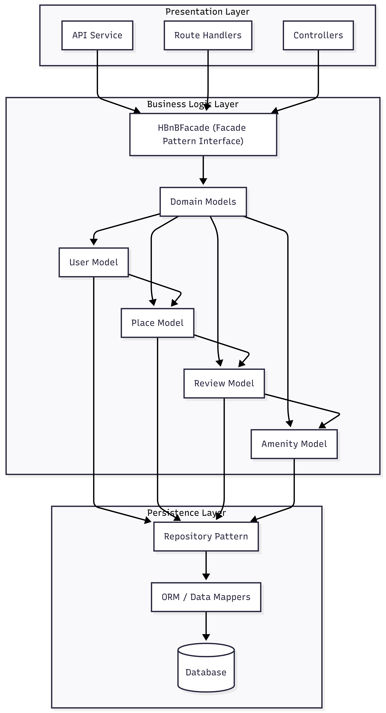
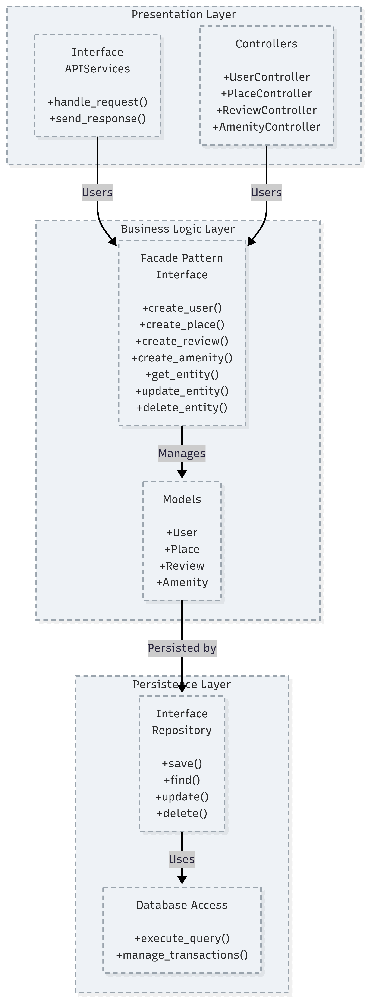

## 0. High-Level Package Diagram
## Overview
This package diagram shows the three-layer architecture of the HBnB Evolution application and how layers communicate through the Facade design pattern.
It was created using **Mermaid.js Documentation**.

## Architecture Layers
### 1) Presentation Layer (Services & API)
- **Responsibility:** Handles user interactions and HTTP requests/responses.
- **Components:** API endpoints, route handlers, controllers/serializers.
- **Communication:** Calls the Business Logic only through **HBnBFacade** (no direct access to models or database).

### 2) Business Logic Layer (Domain Models)
- **Responsibility:** Implements core business rules and validations.
- **Components:** Domain entities (User, Place, Review, Amenity) + service logic.
- **Communication:** Uses persistence interfaces (repositories/DAOs) to store and retrieve data.

### 3) Persistence Layer (Data Access)
- **Responsibility:** Data storage and retrieval.
- **Components:** Repository/DAO layer, ORM/data mappers, database.
- **Communication:** Provides data operations to the Business Logic layer only.

## Facade Pattern (HBnBFacade)
The Facade provides a unified entry point to the business logic:
- Reduces coupling between Presentation and internal domain/persistence details
- Centralizes access to use-cases (create/update/delete/list)
- Improves maintainability and testability

## Request Flow (High-Level)
Client → API/Controllers → **HBnBFacade** → Domain Models/Services → Repositories → Database → Response

## Diagrams

## 1. Detailed Class Diagram for Business Logic Layer
## 📋 Class Diagram - Business Logic Layer
## Class Diagram for HBnB Business Logic Layer

## 📝 Classes Explanation:
## 1. BaseEntity
- Purpose: Base class providing common properties and methods for all entities

- Identifier: UUID id - Unique identifier for each entity

- Methods: Basic CRUD operations (create, save, update, delete)

## 2. User
- Purpose: Represents system users (both regular users and administrators)

- Attributes: Personal information, email, password hash, admin status

- Methods: Registration, profile management, account operations

## 3. Place
- Purpose: Represents rental properties or locations

- Attributes: Title, description, price, geographical coordinates

- Methods: Listing management for properties

## 4. Review
- Purpose: Represents user reviews and ratings for places

- Attributes: Numerical rating, textual comment

- Relationships: Linked to one User and one Place

#3 5. Amenity
- Purpose: Represents features and services available at places

- Attributes: Name, description of the amenity

- Methods: Amenity management operations

## 🔗 Class Relationships:
Relationship	Type	Description
User → Place	Association (1-to-many)	One user can own multiple places
User → Review	Association (1-to-many)	One user can write multiple reviews
Place → Review	Association (1-to-many)	One place can have multiple reviews
Place ↔ Amenity	Association (many-to-many)	One place can have multiple amenities, one amenity can be in multiple places
BaseEntity ← Others	Inheritance	All entities inherit from BaseEntity

## ⚙️ Design Principles Applied:
- SRP (Single Responsibility Principle): Each class has a single, well-defined responsibility

- DRY (Don't Repeat Yourself): BaseEntity prevents code duplication across entities

- Clear Relationship Definition: Proper multiplicity specification for each association

- Unique Identifiers: UUID4 ensures global uniqueness for entity identification

- Consistent Naming: Standardized naming conventions for attributes and methods

## 📊 Multiplicity Notations:
"1" → Exactly one

"0..*" → Zero or more

"1..*" → One or more

Create by: Munirah Enad Alotaibi 

Project: HBnB Evolution - Part 1 

Date: January 2026

