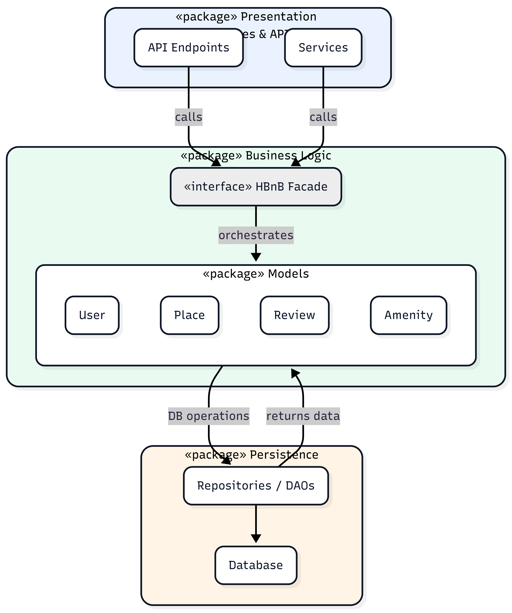

## **0. High-Level Package Diagram**
**Overview:** The diagram outlines the Presentation, Business Logic, and Persistence layers and highlights the Facade as the main bridge between the API and domain logic.
**Architecture Layers (HBnB — High-Level Package Diagram)**
**Diagram Tool:** Mermaid.js (UML Package Diagram)

### 1) Presentation Layer (Services & API)

**Responsibility**
- Handles all user interaction and incoming HTTP requests (request/response lifecycle).

**Key Components**
- RESTful API endpoints (routes/controllers)
- Request/Response handlers (input validation at the API boundary, serialization/deserialization)
- Service/API modules that orchestrate calls to the business layer via the Facade

**Communication**
- Communicates with the Business Logic layer **only through the Facade interface** (no direct access to domain models or persistence components).

---

### 2) Business Logic Layer (Domain Models & Rules)

**Responsibility**
- Contains the core domain logic and business rules of the HBnB application.

**Key Components**
- Domain entities/models: `User`, `Place`, `Review`, `Amenity`
- Business rules and domain validation (constraints and invariants)
- Facade as a unified entry point for application use-cases

**Communication**
- Receives requests from the Presentation layer via the **Facade**
- Interacts with the Persistence layer to retrieve and store data (typically through repositories/DAOs)

---

### 3) Persistence Layer (Data Access)

**Responsibility**
- Manages data storage and retrieval.

**Key Components**
- Repositories / DAOs (data access components)
- ORM mappings (if applicable)
- Database operations (CRUD and queries)
- Database (the storage engine)

**Communication**
- Provides data access services to the Business Logic layer
- Does **not** communicate directly with the Presentation layer

---

## Required Communication Path (via Facade)

- **Presentation Layer → Facade (Business Logic Layer) → Persistence Layer**
- Data/results flow back in reverse: **Persistence → Facade/Business Logic → Presentation**
- ## Facade Pattern Implementation

The **Facade** provides a unified interface between the **Presentation Layer** and the **Business Logic Layer**, which:

- Simplifies communication between layers by exposing a single entry point for use-cases
- Reduces coupling and dependencies (Presentation does not directly access domain models or persistence components)
- Centralizes access to business logic through the Facade
- Improves maintainability and testability by isolating layer interactions behind a stable interface

## **Package Diagram**

  ## Why This Architecture?

### Separation of Concerns
- Each layer focuses on one responsibility (API, domain logic, data access).
- Updates stay contained, which makes maintenance and testing easier.

### Facade Benefits
- Provides a single entry point for business use-cases.
- Keeps the API layer independent from database/repository details.
- Improves flexibility and supports clean refactoring.

### Communication Flow
Client → API/Services → Facade → Domain Models/Rules → Repositories/DAOs → Database  
Response returns through the same path in reverse.

## Implementation Notes 

- The application is organized into three clear layers: **Presentation**, **Business Logic**, and **Persistence**.
- The **Presentation Layer** communicates with the domain only through the **Facade**, which acts as the single entry point for business use-cases.
- The **Facade** applies core validation and business rules, then delegates data access to the **Persistence** components (repositories/DAOs).
- The **Persistence Layer** is kept independent from API/presentation concerns and is accessed only by the Business Logic layer.

---

**Created by:** Munirah Enad Alotaibi  
**Project:** HBnB Evolution - Part 1  
**Date:** Feb 2026  

---

