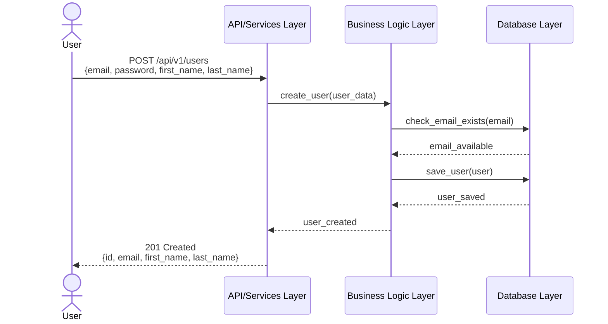
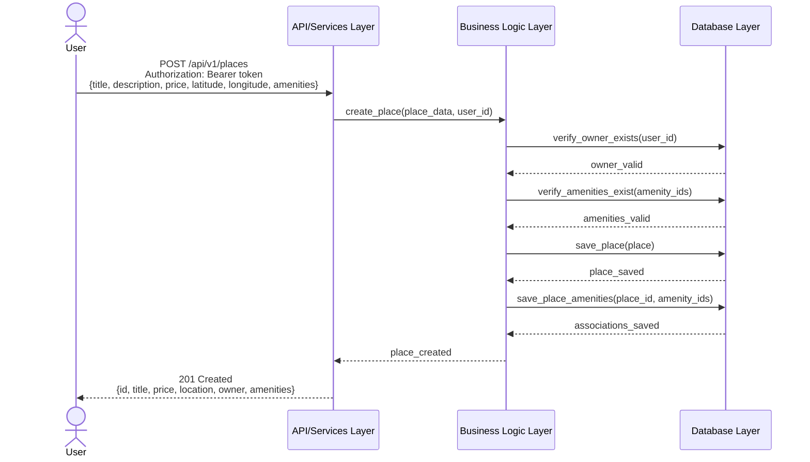
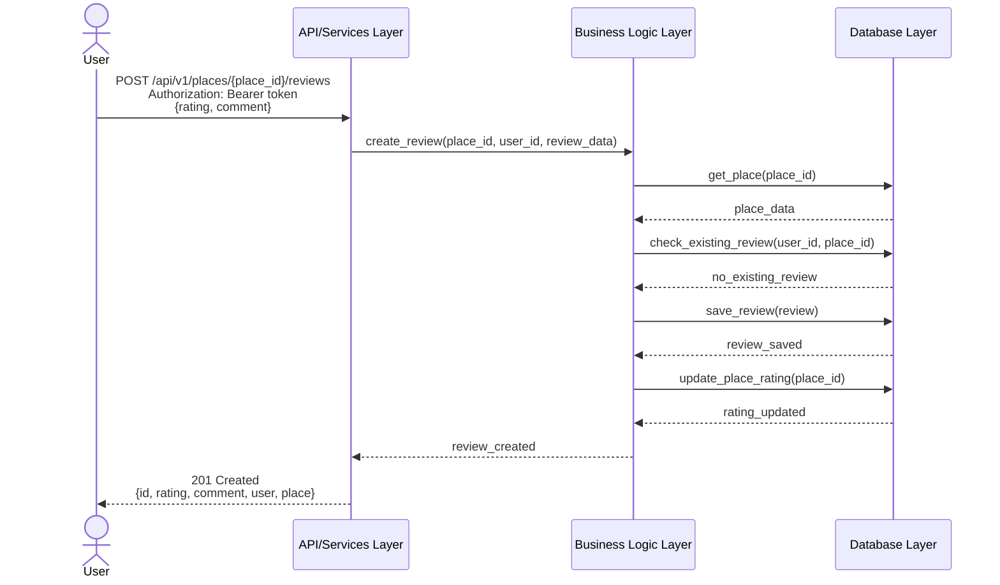
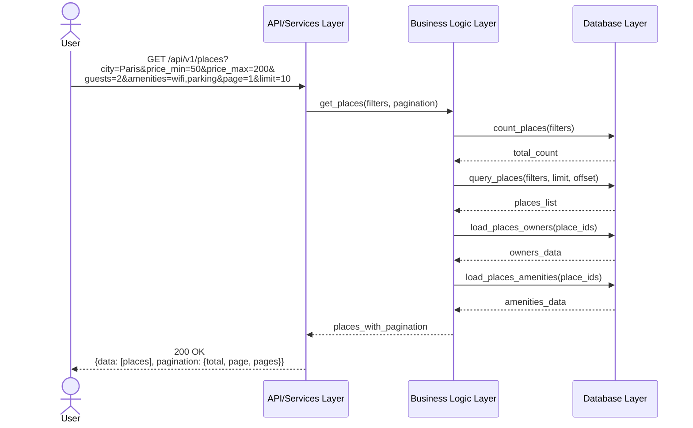

# HBnB Application - Sequence Diagrams

This document contains sequence diagrams for four critical API operations in the HBnB application, illustrating the flow of interactions across the API/Services Layer, Business Logic Layer, and Database Layer.

---

## Table of Contents
1. [User Registration](#1-user-registration)
2. [Place Creation](#2-place-creation)
3. [Review Submission](#3-review-submission)
4. [Fetching a List of Places](#4-fetching-a-list-of-places)

---

## 1. User Registration

### Description
The User Registration API allows new users to create an account in the HBnB system. This process involves validating user input, checking for duplicate accounts, creating a new user entity, persisting it to the database, and returning a success response with the user details.

### Key Steps
1. Client sends registration request with user details (email, password, first name, last name)
2. API/Services layer validates the request data format
3. Business Logic checks if email is already registered
4. Password is hashed for security
5. User entity is created with validated data
6. User is persisted to the database
7. Success response with user details (excluding password) is returned

### Sequence Diagram

---

## 2. Place Creation

### Description
The Place Creation API enables authenticated users to create new property listings in the HBnB system. This involves validating the user's authentication, checking ownership permissions, validating place details, and persisting the new place to the database with associations to the owner and amenities.

### Key Steps
1. Client sends authenticated request with place details
2. API/Services layer validates authentication token
3. Business Logic validates place data (title, description, price, location, etc.)
4. System verifies owner exists and amenities are valid
5. Place entity is created with relationships
6. Place is persisted to the database with owner and amenity associations
7. Success response with complete place details is returned

### Sequence Diagram

---

## 3. Review Submission

### Description
The Review Submission API allows authenticated users to submit reviews for places they have visited. This involves validating authentication, ensuring the user hasn't already reviewed the place, checking that users can't review their own properties, validating the review content and rating, and persisting the review with proper associations.

### Key Steps
1. Client sends authenticated request with review details (rating, comment)
2. API/Services layer validates authentication token
3. Business Logic validates review data (rating between 1-5, comment length)
4. System checks if place exists and user hasn't already reviewed it
5. System prevents users from reviewing their own places
6. Review entity is created with associations to user and place
7. Review is persisted to the database
8. Place's average rating is updated
9. Success response with review details is returned

### Sequence Diagram

---

## 4. Fetching a List of Places

### Description
The Fetching Places API retrieves a list of places based on various filtering criteria such as location, price range, number of guests, and amenities. This is typically used for search and discovery features. The operation involves parsing query parameters, applying filters, and returning paginated results with associated data.

### Key Steps
1. Client sends GET request with optional query parameters (filters, pagination)
2. API/Services layer validates and parses query parameters
3. Business Logic builds filter criteria from parameters
4. Database query is constructed with WHERE clauses for filters
5. Total count is retrieved for pagination metadata
6. Results are fetched with pagination (limit and offset)
7. Associated data (owner, amenities) is loaded for each place
8. Paginated response with place list and metadata is returned

### Sequence Diagram

---

## Layer Descriptions

### API/Services Layer
**Responsibilities:**
- Handle HTTP requests and responses
- Validate request format and authentication tokens
- Parse and validate query parameters
- Transform data between external API format and internal format
- Return appropriate HTTP status codes and error messages
- Manage sessions and security

### Business Logic Layer
**Responsibilities:**
- Implement core business rules and domain logic
- Validate entity data and relationships
- Coordinate operations across multiple entities
- Enforce business constraints (e.g., no self-reviews, unique emails)
- Manage entity lifecycle and state
- Calculate derived values (e.g., average ratings)

### Database Layer
**Responsibilities:**
- Handle data persistence and retrieval
- Execute database queries (SELECT, INSERT, UPDATE, DELETE)
- Manage database connections and transactions
- Ensure data integrity and referential constraints
- Optimize query performance
- Handle data mapping between database records and application objects

---

## Common Patterns

### Request Validation Flow
All operations follow a consistent validation pattern:
- **Format Validation** (API/Services Layer): Check request structure and data types
- **Authentication** (API/Services Layer): Verify user identity and permissions
- **Business Validation** (Business Logic Layer): Enforce business rules and constraints
- **Data Integrity** (Database Layer): Ensure referential integrity and constraints

### Error Handling
Each layer can return errors that propagate up to the client:
- **API/Services Layer**: 400 Bad Request, 401 Unauthorized, 403 Forbidden
- **Business Logic Layer**: 409 Conflict, 422 Unprocessable Entity
- **Database Layer**: 500 Internal Server Error, constraint violations

### Data Transformation
Data is transformed at each layer boundary:
- **Client → API**: JSON to request objects
- **API → Business Logic**: Request objects to domain entities
- **Business Logic → Database**: Domain entities to database records
- **Return path**: Reverse transformation with sensitive data filtering

---

## API Endpoint Summary

| Endpoint | Method | Purpose | Authentication Required |
|----------|--------|---------|------------------------|
| `/api/v1/users` | POST | User registration | No |
| `/api/v1/places` | POST | Create place listing | Yes |
| `/api/v1/places/{id}/reviews` | POST | Submit review | Yes |
| `/api/v1/places` | GET | List/search places | No |

---

## Notes

- All passwords are hashed before storage using secure hashing algorithms
- Authentication tokens are validated on protected endpoints
- Database queries use parameterized statements to prevent SQL injection
- Pagination is implemented to handle large result sets efficiently
- Business rules are enforced at the Business Logic Layer
- Each layer has clear, separated responsibilities following the separation of concerns principle

---

## 👥 Authors
**Amaal Asiri** – Holberton School Student as part of a group project 

---

## 📄 License
This project is open source and intended for educational purposes as part of the Holberton School curriculum.
