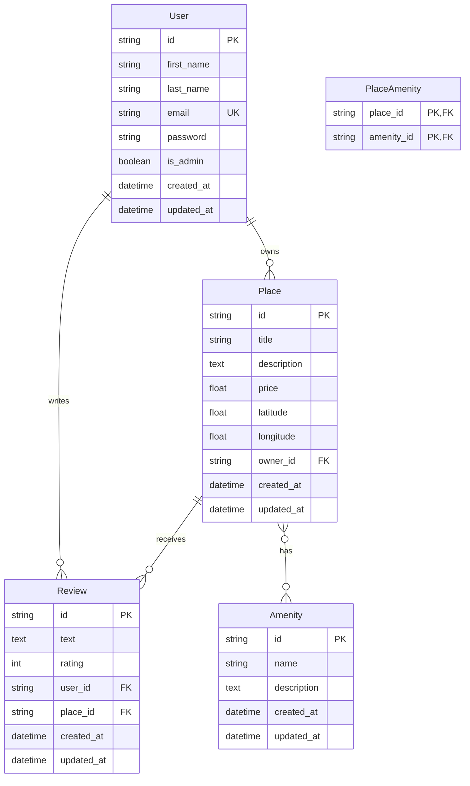

# ER Diagram - HBnB Database Schema

## 📊 Diagram

---

## 📋 **Tables Description**

| Table | Description |
|-------|-------------|
| **User** | Stores user information including personal details and authentication data |
| **Place** | Stores rental property information such as title, description, price, and location |
| **Review** | Stores user reviews and ratings for places |
| **Amenity** | Stores available amenities/features that can be added to places |
| **PlaceAmenity** | Junction table for many-to-many relationship between Place and Amenity |

---

## 🔑 **Table Details**

### **User Table**
| Column | Type | Constraints | Description |
|--------|------|-------------|-------------|
| `id` | String(36) | Primary Key | Unique identifier (UUID) |
| `first_name` | String(50) | Not Null | User's first name |
| `last_name` | String(50) | Not Null | User's last name |
| `email` | String(120) | Not Null, Unique | User's email address |
| `password` | String(128) | Not Null | Hashed password |
| `is_admin` | Boolean | Default: False | Admin privileges flag |
| `created_at` | DateTime | Not Null | Timestamp of creation |
| `updated_at` | DateTime | Not Null | Timestamp of last update |

### **Place Table**
| Column | Type | Constraints | Description |
|--------|------|-------------|-------------|
| `id` | String(36) | Primary Key | Unique identifier (UUID) |
| `title` | String(100) | Not Null | Title of the place |
| `description` | Text | - | Detailed description |
| `price` | Float | Not Null | Price per night |
| `latitude` | Float | Not Null | Latitude coordinate |
| `longitude` | Float | Not Null | Longitude coordinate |
| `owner_id` | String(36) | Foreign Key | References User(id) |
| `created_at` | DateTime | Not Null | Timestamp of creation |
| `updated_at` | DateTime | Not Null | Timestamp of last update |

### **Review Table**
| Column | Type | Constraints | Description |
|--------|------|-------------|-------------|
| `id` | String(36) | Primary Key | Unique identifier (UUID) |
| `text` | Text | Not Null | Review content |
| `rating` | Integer | Not Null | Rating (1-5) |
| `user_id` | String(36) | Foreign Key | References User(id) |
| `place_id` | String(36) | Foreign Key | References Place(id) |
| `created_at` | DateTime | Not Null | Timestamp of creation |
| `updated_at` | DateTime | Not Null | Timestamp of last update |

### **Amenity Table**
| Column | Type | Constraints | Description |
|--------|------|-------------|-------------|
| `id` | String(36) | Primary Key | Unique identifier (UUID) |
| `name` | String(50) | Not Null | Name of the amenity |
| `description` | String(200) | - | Description of the amenity |
| `created_at` | DateTime | Not Null | Timestamp of creation |
| `updated_at` | DateTime | Not Null | Timestamp of last update |

### **PlaceAmenity Table** (Junction Table)
| Column | Type | Constraints | Description |
|--------|------|-------------|-------------|
| `place_id` | String(36) | Primary Key, Foreign Key | References Place(id) |
| `amenity_id` | String(36) | Primary Key, Foreign Key | References Amenity(id) |

---

## 🔗 **Relationships**

### One-to-Many Relationships

| Relationship | Cardinality | Foreign Key | Description |
|-------------|-------------|-------------|-------------|
| **USER → PLACE** | `\|\|--o{` | `PLACE.owner_id` references `USER.id` | A user can own multiple places, but each place has one owner |
| **USER → REVIEW** | `\|\|--o{` | `REVIEW.user_id` references `USER.id` | A user can write multiple reviews, but each review is written by one user |
| **PLACE → REVIEW** | `\|\|--o{` | `REVIEW.place_id` references `PLACE.id` | A place can have multiple reviews, but each review belongs to one place |

### Many-to-Many Relationship

| Relationship | Cardinality | Junction Table | Foreign Keys |
|-------------|-------------|----------------|--------------|
| **PLACE ↔ AMENITY** | `}o--o{` | `PLACE_AMENITY` | `PLACE_AMENITY.place_id` references `PLACE.id` `PLACE_AMENITY.amenity_id` references `AMENITY.id` |

**Description:** A place can have many amenities, and an amenity can belong to many places.

---

## 📊 **Cardinality Symbols**

| Symbol | Meaning |
|--------|---------|
| `\|\|` | Exactly one |
| `o\|` | Zero or one |
| `}\|` | One or more |
| `}o` | Zero or more |

---

## 📝 **Foreign Keys Summary**

| Table | Foreign Key | References |
|-------|-------------|------------|
| Place | `owner_id` | User(`id`) |
| Review | `user_id` | User(`id`) |
| Review | `place_id` | Place(`id`) |
| PlaceAmenity | `place_id` | Place(`id`) |
| PlaceAmenity | `amenity_id` | Amenity(`id`) |

---

## 🎯 **Implementation Notes**

- All `id` fields are UUID4 strings stored as VARCHAR(36)
- Timestamps (`created_at`, `updated_at`) are automatically managed
- Email uniqueness is enforced at database level
- The `PlaceAmenity` table enables the many-to-many relationship between Place and Amenity
- All foreign keys ensure referential integrity with CASCADE behavior

---

## 👀 **Viewing the Diagram**

- **Online Editor:** [Mermaid Live Editor](https://mermaid.live)
- **GitHub:** Automatically renders Mermaid diagrams in markdown files
